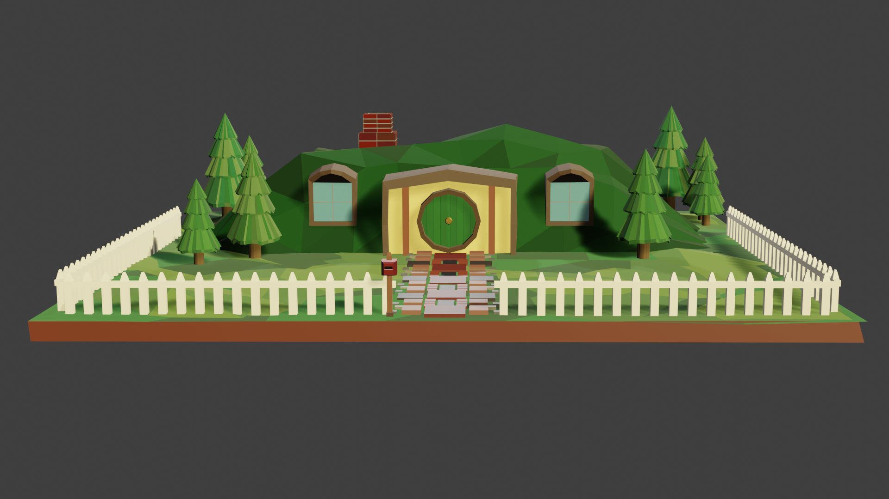
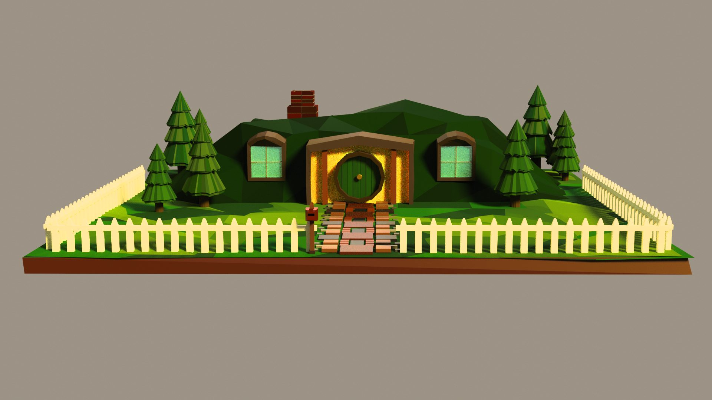
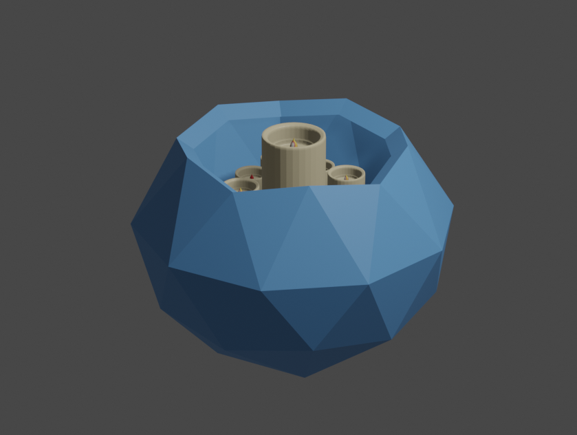
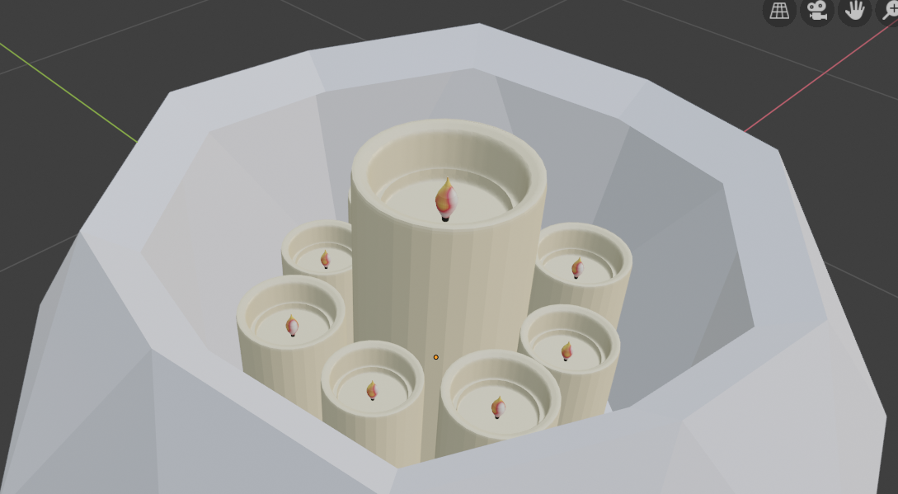
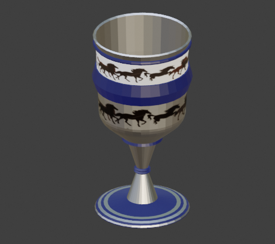
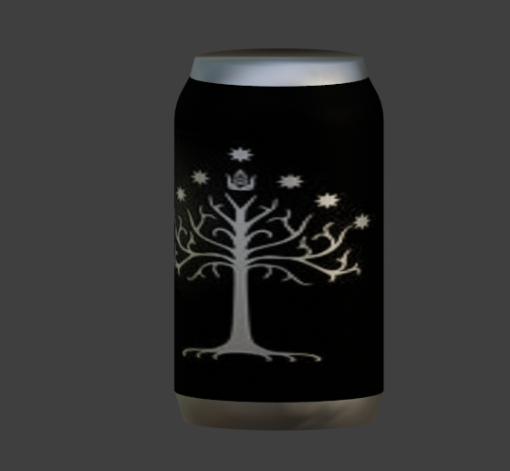
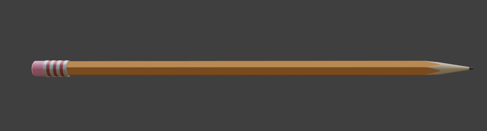
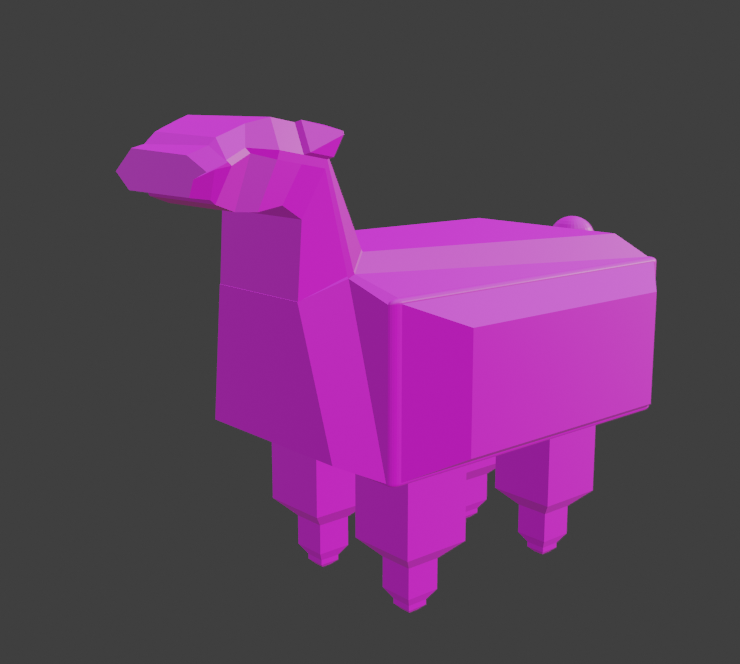

# The Road (to CAD modeling) Goes Ever On and On

While clearing out storage on my laptop, I stumbled across the initial render below. For the record, I didn't even know I had these files, nor did I realize I still had <a href="https://www.blender.org/">Blender</a> installed on my laptop, so when I stumbled across this first render of Hobbiton from 2019, I went on an adventure to find the rest of my first CAD models. 
## Hobbithole - Eevee

Above, hobbithole rendered in Eevee, a final project submitted for a highschool elective I took on a whim. Little did I know that my road through 3D modeling was far from over when I submitted my hobbit hole, but what better place to begin a journey? That being said, when I rediscovered this five years later, I realized I'd completely forgotten how to do anything in Blender, and spent probably an hour digging for the rest of my files. In the process, I experimented with rendering using Cycles, seen below.

## Hobbithole - Cycles

## **Desk Scene Compilation**

<!--  -->
The other final submission for the elective was to compile the objects from all the lessons in the class. Since none of the sub-components are really impressive enough to warrant their own pages, here they are. 

## Candle, with eight mini candles around a main central candle.

Apparently I cared way too much about this elective, since I even put the details of a flame pattern onto the candles. 

## 
Goblet, with horses inspired by the Rohirrim to contribute to the LOTR theme.

## 
Soda can wrapped with the tree of Gondor- apparently it didn't make it into the final render of the desk scene that I submitted, but I can't remember why. Maybe they insisted on having an actual soda label.

## 
Just a standard yellow pencil. Probably the first object they had us make in class. 

<!-- how do i change the scaling of these things cuz it be ugly rn -->

## 

Last but not least, Meep the Alpha Sheep

Mr. Meep the Sheep was the very first model I made for myself in Blender, making him my firstborn CAD model. The day after they taught us the basic controls in class, I went home and created this... creature. I have no clue why it's pink, I definitely did not make that choice. He's not the prettiest, but since he's the original, I guess he deserves a feature. 