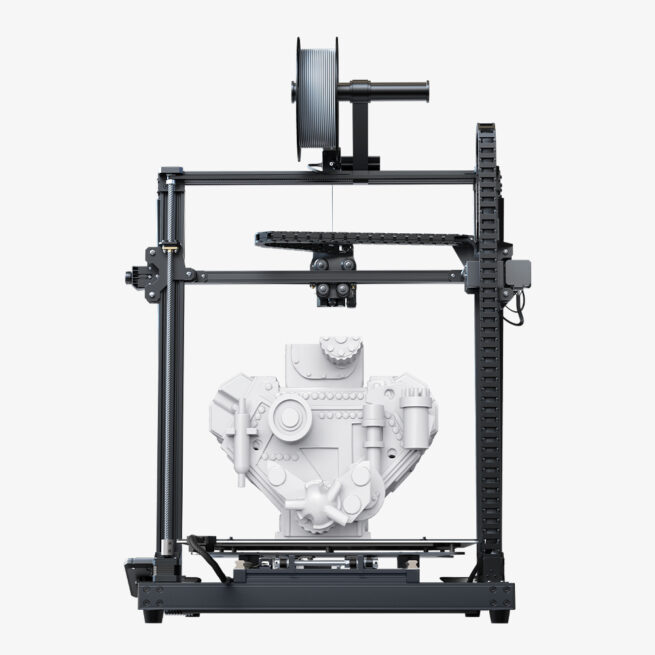

# SantaBear 

Santa bear ornaments for my adorable absolutely cutest nephew done on this 3D printer. (may or may not have been written by my brother, account for bias. but he really is adorable)

One of the very convenient things about being an artistic engineer is that I get to bridge the gaps between my interests to create fun (cheap) gifts for familiy and friends. With Christmas coming up and in celebration of my nephew's first Christmas, I decided to design an ornament for my family using my recently discovered organic modeling app, <a href="https://nomadsculpt.com/">Nomad Sculpt</a>. I modeled a bear, added a santa hat and a few words, hit print, and called it good. A few iterations and a splash of paint later, I gave my bears to 4-5 friends for Christmas 2023... which means I don't really have pictures of the printed versions.


<!-- ^^ to insert new images -->

You can find the files on my thingiverse account (see <a href="https://www.thingiverse.com/properbowen/designs">this homepage</a> for example).
<!-- Insert hyperlinks with ahref -->

<!-- 
**BOLD FONT**
*ITALIC FONT*

``` python
print("HELLO KARISSA")
```
 -->
